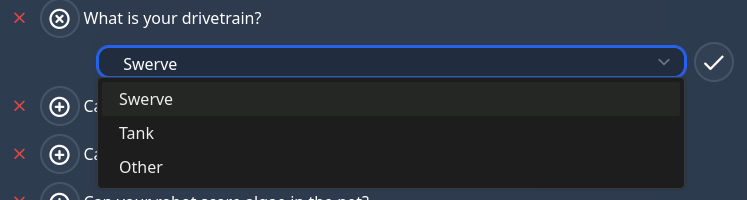
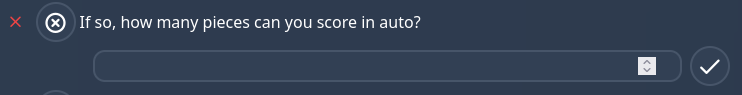

# Formatting Pit Scouting Questions

This page describes how to format `pit_scouting_questions.py` for each new year. This file describes the master list of pit scouting questions and the questions inside will be displayed as the starting list of questions in the `/pits` page. 

You can view the current `pit_scouting_questions.py` file [here](https://github.com/FRC-Team3484/open-scouting/blob/main/scouting/main/pit_scouting_questions.py)

## Types of questions
This section demonstrates what each of the available questions are and their parameters.

First, there's some parameters that every question requires

- `text` The the main text for the question, this is what appears in the `/pits` page
- `simple_name` The simple name of the question, this is used internally to store the question and its answers in the database
- `type` The type of question that is being created, this is used to determine how the question will be displayed in the `/pits` page
- `answers` This should always be an empty list, and is used to store the answers to the question when the question is copied into the database

### `choice`
Creates a drop down menu, scouts can select one of the choices in the list



```json
{
    "text": "What is your drivetrain?",
    "simple_name": "drivetrain",
    "type": "choice",
    "choices": ["Swerve", "Tank", "Other"],
    "answers": [],
},
```

- `choices` indicates the list of choices that the scouts can select from

### `boolean`
Creates a checkbox, which is either true or false


```json
{
    "text": "Can your robot score coral in the reef?",
    "simple_name": "reef",
    "type": "boolean",
    "answers": [],
},
```

This question has no additional parameters

### `number`
Creates an input which takes numbers



```json
{
    "text": "If so, how many pieces can you score in auto?",
    "simple_name": "auton_pieces",
    "type": "number",
    "answers": [],
},
```

This question has no additional parameters

### `text`
Creates an input which takes text


```json
{
    "text": "How often do you meet in build season?",
    "simple_name": "meeting_frequency",
    "type": "text",
    "answers": [],
},
```

This question has no additional parameters