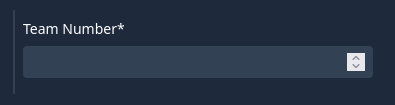
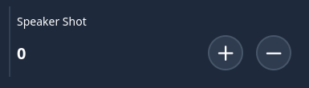
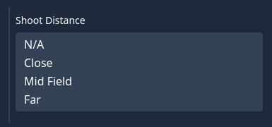
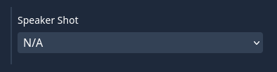
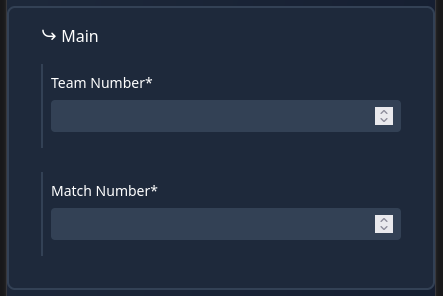

# Formatting Season Fields

This page documents how the data in `season_fields.py` should be formatted and set up each year, to aid in quickly setting up the json when a new season begins

`season_fields.py` is used to define all the fields and sections needed for scouts to contribute data to the server when scouting. A single field represents a key value pair which is stored in the database for each needed information about the year

You can view the current `season_fields.py` file [here](https://github.com/nfoert/open-scouting/blob/main/scouting/main/season_fields.py)

## Types of fields
This section demonstrates what each of the available fields are and their parameters

Every field needs at least five parameters, `name`, `simple_name`, `type`, `required` and `order`
- `name` indicates the display name of the field, this is the title over the field that appears in the `/submit` UI
- `simple_name` is the simple name of the field, that will be used as the key in the key value pair when the data is stored in the database
- `type` should be one of the following types listed below. This indicates the type of field that is being created, and what data it will return
- `required` indicates if the field is required to have contents to allow the form to be submitted. Setting this parameter to `True` should be kept to a minimum, to prevent frustration during scouting, and allowing for data to be kept empty if it's not needed
- `order` indicates the order in which each field is shown in the `/data` table
  - The data should be organized such that the way that the fields are visible on `/submit` (top-to-bottom which matches how they're ordered in `season_fields.py`) matches the `order` parameter. The first one in the list should be the lowest and the last one should be the highest
  - Sections are not given an order as they are not shown in the table at `/data`

### `large_integer`
This field should be used for fields like the team number or match number



```json
{
    "name": "Team Number",
    "simple_name": "team_number",
    "type": "large_integer",
    "required": True,
    "order": 1,
},
```

This field has no additional parameters

### `integer`
This field should be used for any smaller integer values, like the number of scores or misses



```json
{
    "name": "Speaker Shot",
    "simple_name": "speaker_shot",
    "type": "integer",
    "default": 0,
    "minimum": 0,
    "maximum": 30,
    "required": False,
    "order": 1,
},
```

- `default` is the default value that the field will show when the form is first loaded
- `minimum` specifies the minimum value that the field can have. The buttons won't allow the number to reach any lower than this
- `maximum` specifics the maximum value that the field can have. The buttons won't allow the number to reach any higher than this

### `boolean`
This field should be used for any value that should be true or false, like if a robot scored in the end game location or not


```json
{
    "name": "Left Starting Zone",
    "simple_name": "left_starting_zone",
    "type": "boolean",
    "required": False,
    "order": 1,
},
```

This field has no additional parameters

### `multiple_choice`
This field allows the user to select multiple choices, for example if scouts wanted to indicate multiple distances from with the robot could score from



```json
{
    "name": "Shoot Distance",
    "simple_name": "shoot_distance",
    "type": "multiple_choice",
    "choices": ["N/A", "Close", "Mid Field", "Far"],
    "required": False,
    "order": 1,
},
```

- `choices` indicates the list of choices that the scouts can select from. Scouts can select more than one value fpr this field

### `choice`
This field allows the user to select a single choice from a list, in case scouts wanted to indicate something like if the team got any penalties or scored



```json
{
    "name": "Speaker Shot",
    "simple_name": "speaker_shot",
    "type": "choice",
    "choices": ["N/A", "1", "2", "3", "4", "5", "6", "7", "8", "9", "10"],
    "required": False,
    "order": 1,
},
```

- `choices` indicates the list of choices that the scouts can select from. Scouts can only select one value for this field

## Creating Sections
Sections are used to combine multiple fields into one block in the `/submit` UI. Sections can be nested inside of sections for further organization.

The parameters to create a section are as follows:
- `section` is the display name of the section. It's what appears in the title at the top of the section
- `simple_name` is the simple name of the section, it's used internally to render sections in the `/submit` UI
- `fields` is a list of fields that are contained in the section. Any fields above can be used in this parameter to create a section with fields inside of it

```json
{
      "section": "Main",
      "simple_name": "main",
      "fields": [],
  },
```

An example section is below:



```json
{
    "section": "Main",
    "simple_name": "main",
    "fields": [
        {
            "name": "Team Number",
            "simple_name": "team_number",
            "type": "large_integer",
            "required": True,
            "order": 1,
        },
        {
            "name": "Match Number",
            "simple_name": "match_number",
            "type": "large_integer",
            "required": True,
            "order": 2,
        },
    ],
},
```

